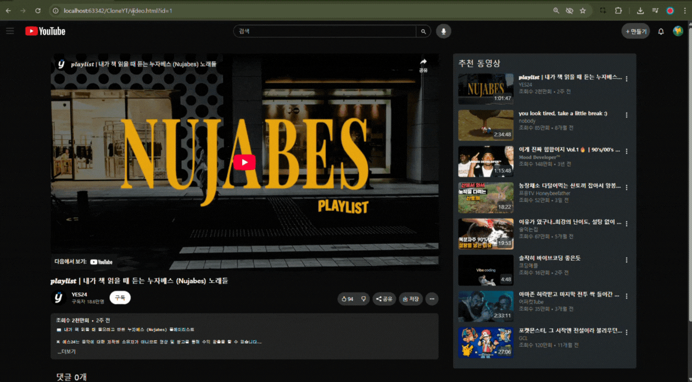
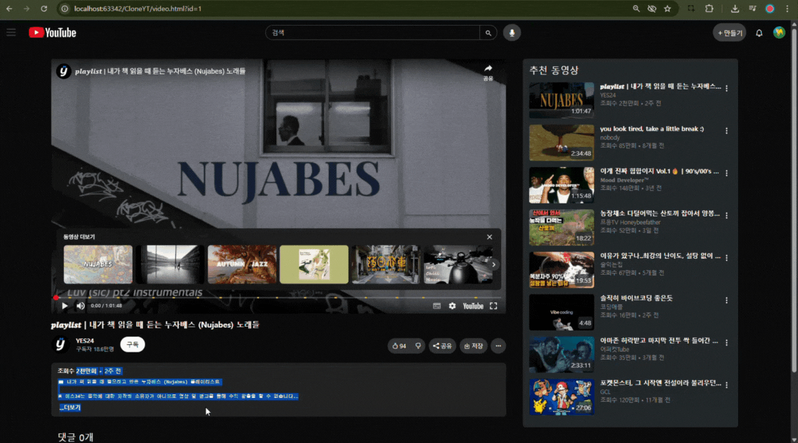

# 🔗[CloneYT](https://ihan0412.github.io/CloneYT/ "Youtube-clone") ▶️

[📋요구사항](#a-namedemanda-요구사항)

[🎯목표](#a-nametargeta-목표)

[📚기술 스택 & 개발 환경](#a-namestacka-기술-스택--개발-환경)

[📦디렉토리 구조](#a-namestructurea-디렉토리-구조)

[📸구현 + ⚙️기능 설명](#a-nameimplementa-구현--기능-설명)

[🙄회고](#a-namediarya-회고)

[🔗참고 문헌](#)

<br>

## ▶️ Youtube Clone Coding 개요


<br>

### <a name="demand"></a> 📋요구사항


1. 메인화면

   - 상단 네비게이션 바 (로고, 검색창, 사용자 아이콘)
     - 로고 클릭시 홈페이지 상단 리로드
     - 검색창(검색기능은 추가 구현 사항)
     - 사용자 아이콘 클릭시 계정 정보(모든 버튼을 구현하되, 버튼 기능은 구현하지 않아도 됨)
   - 좌측 사이드바 (홈, 구독 아이콘 포함)
     - 홈 클릭시 홈페이지 상단 리로드
     - 구독 아이콘 클릭시 구독 관련 페이지 (실제 구독 페이지처럼)
   - 영상 썸네일 카드 영역 (8개 이상)
   - 썸네일, 영상 제목, 채널명, 조회수, 업로드 날짜 표시
   - 마우스 호버 시 카드 에니메이션 (확대 등 자유)

<br>

2. 영상 상세 페이지 구현 및 URL 구조 설계

   - 각 영상 클릭 시 video.html?videoId=1 형식의 페이지로 이동 
   - JS로 videoId 파라미터 읽기 
   - 상세 페이지에는 다음 정보 표시 
     - 영상 iframe (YouTube 임베드)
     - 제목, 채널명, 조회수, 업로드일 
     - 설명 영역

<br>

3. 사용자 인터렉션 (2가지 이상 구현)

   - 댓글 작성 기능 (로컬 저장 하지 않아도 괜찮음. ex. 댓글 작성해서 등록이 가능하지만, 해당 페이지에 다시 들어왔을 때는 해당 댓글이 남아있지 않아도 됩니다.)
   - 좋아요 / 싫어요 버튼 상태 반영 
   - 우측 재생 목록 반응형 디자인
   
<br>

   - 결과물 배포


<br>

### <a name="target"></a> 🎯목표


- 부트스트랩을 이용하여 레이아웃과 반응형 웹 구현
- Youtube 동작 원리를 이해하여 Clone 해, 웹 페이지 구조 학습
- js 를 이용한 웹 재사용 이해 
- 응용 프론트엔드 프로젝트 수행


<br>

### <a name="stack"></a> 📚기술 스택 & 개발 환경


- 기술 스택
<p>
    
    
    
</p>

- 개발 환경 & 형상 관리
<p>
    
    
</p>

<br>

### <a name="structure"></a> 📦디렉토리 구조

```
📦 CloneYT
┣ 📂 .idea/
┣ 📂 css/
┃ ┣ 📜 home.css # 메인 화면
┃ ┣ 📜 sidebar.css # 상단바, 사이드바
┃ ┣ 📜 sub.css # 구독 화면
┃ ┣ 📜 video.css # 영상 재생 화면
┃ ┣ 📜 videolist.css # 영상 리스트 스타일
┃ ┗ 📜 videoNavbar.css # 영상 재생 화면 사이드바
┣ 📂 img/ # 사용 이미지 DIR
┣ 📂 js/
┃ ┣ 📜 renderHorizontalCards.js # 영상 재생 화면 반응형 구현 가로
┃ ┣ 📜 renderVerticalCards.js # 반응형 구현 세로
┃ ┣ 📜 sidebar.js # 사이드 바 
┃ ┣ 📜 subRender.js # 구독 구현
┃ ┣ 📜 subRenderHorizontal.js # 구독 화면 정렬
┃ ┣ 📜 subToggleVideoList.js 
┃ ┣ 📜 video.js # 영상 재생 화면
┃ ┗ 📜 videoData.js # 영상 Data
┣ 📂 readmeimg/
┣ 📜 index.html # 홈 화면
┣ 📜 sub.html # 구독 화면
┗ 📜 video.html # 영상 재생 화면
```

<br>

## <a name="implement"></a> 📸구현 + ⚙️기능 설명

#### 상단바 로고 ( 홈으로 이동 ) , 검색창, 드롭다운


#### 반응형 사이드바 (2가지)


#### 8개 이상의 영상 list, 섬네일 표현, 마우스 오버 효과


#### 구독 페이지 + 구조 변경


#### 영상 클릭시 쿼리 스트링 형식으로 이동 + js 로 파라미터 읽기 



#### 상세 페이지 정보 표시 + 좋아요 싫어요 버튼



#### 댓글 작성


#### 우측 재생 목록 반응형


<br>

## <a name="diary"></a> 🙄회고


<br>

### <a name="hard"></a> 🤯어려웠던 점


<br>

### <a name="learn"></a> ✏️배운 점


<br>

### 🔗참고 문헌


[README 문법](https://inpa.tistory.com/entry/MarkDown-%F0%9F%93%9A-%EB%A7%88%ED%81%AC%EB%8B%A4%EC%9A%B4-%EB%AC%B8%EB%B2%95-%F0%9F%92%AF-%EC%A0%95%EB%A6%AC#links_anchor_%EB%A7%81%ED%81%AC) - Inpa Dev 블로그

[부트스트랩 flex](https://getbootstrap.kr/docs/5.0/utilities/flex/) - 공식

[부트스트랩 반응형 그리드](https://inpa.tistory.com/entry/BootStrap5-%F0%9F%93%9A-%EB%B0%98%EC%9D%91%ED%98%95-%EC%8B%9C%EC%8A%A4%ED%85%9C-%EC%A0%95%EB%A6%AC-%EA%B7%B8%EB%A6%AC%EB%93%9C) - Inpa Dev 블로그

[부트스트랩 Column 정렬](https://inpa.tistory.com/entry/BootStrap5-%F0%9F%93%9A-%EB%B0%98%EC%9D%91%ED%98%95-%EC%8B%9C%EC%8A%A4%ED%85%9C-%EC%A0%95%EB%A6%AC-%EC%A0%95%EB%A0%AC) - Inpa Dev 블로그

[InnerHTML 위험성 & 예방 방법](https://velog.io/@lybell_4rt/XSS%EB%A5%BC-%EC%95%84%EC%8B%9C%EB%82%98%EC%9A%94feat.-innerHTML%EC%9D%98-%EC%9C%84%ED%97%98%EC%84%B1) - 블로그


